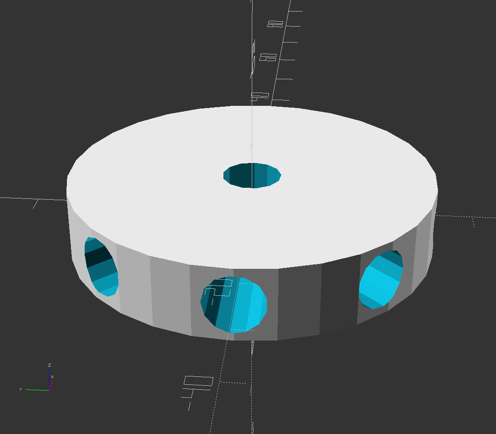
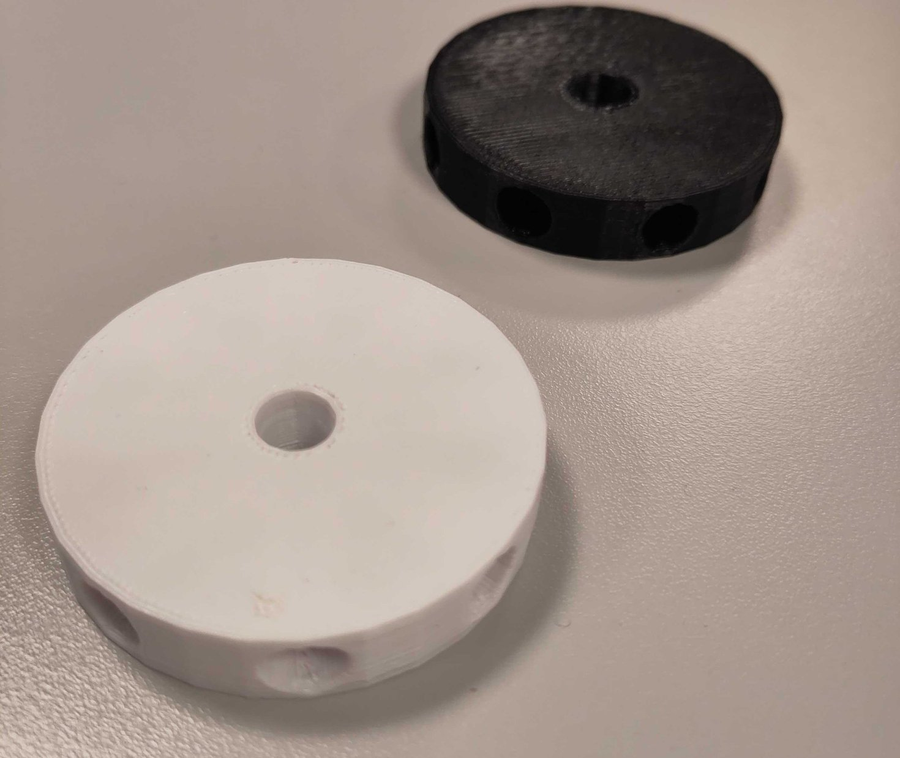

# An open scad generator for git visualization
inspired by [Git for ages 4 and up](https://www.youtube.com/watch?v=3m7BgIvC-uQ), this project generates props for this kind of presntation. 

|OpenSCAD preview| First prints|
|----|----|
|||